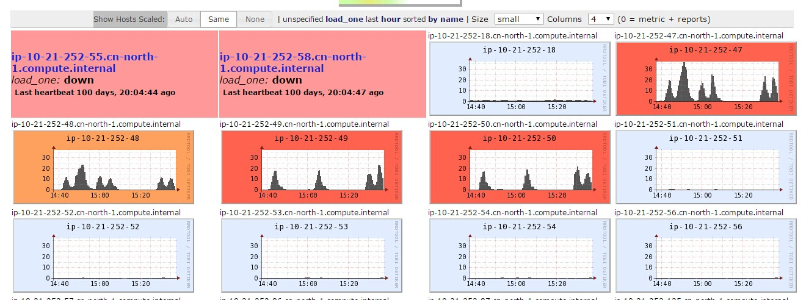

#HBase场景测试

## 读取1个测风塔2年的数据，之前测试结果是2秒多

### 1天1个线程

文件大小 | 数据行数 | 数据格式 |存储方式 | Cluster Node Network out | Local Network In
--- |--- | --- |--- |--- |---
22 M | 98082 |10分钟一行 | 1个测风塔每3天一片 | 1~2M/s（m1.xlarge）|70M/s （m3.xlarge）

Round |Machine| Time/ms | Machine| Time/ms
--- |--- | --- |--- | --- 
1 |m3.xlarge| 15273 | c8.xlarge |8042
2 || 6753 ||6433
3 || 5268 ||6308
4 || 6831 ||6547
5 || 5978  

## 模拟在1个节点上读取1个测风塔2年的数据 

### 1天1个线程

文件大小 | 数据行数 | 数据格式 |存储方式 | Cluster Node Network out | Local Network In
--- |--- | --- |--- |--- |---
22 M | 98082 |10分钟一行 | 1个测风塔2年一片 | 45M/s（m1.xlarge）|46M/s （m3.xlarge）

Round |Machine| Time/ms 
--- |--- | --- 
1 |m3.xlarge| 8825  
2 || 6365 
3 || 6305 
4 || 7093 
5 || 6255  

### shell 单线程scan，kv形式，保存为一个文件 

	
	时间：590.9930 s     
	保存完整rowkey-value数据 文件401M
### java 单线程scan，十分钟一条，保存为一个文件  
	时间： 51002 ||50851  
	保存一行十分钟数据 文件21M

##4个并发，读取测风塔2年的数据，之前测试结果是需要8秒（时间线性增长）
	
### 1天1个线程
文件大小 | 数据行数 | 数据格式 |存储方式 | Cluster Node Network out | Local Network In
--- |--- | --- |--- |--- |---
22 M | 98082 |10分钟一行 | 1个测风塔每3天一片 | 1~2M/s（m1.xlarge） | 70~100M/s （m3.xlarge）

Round |Machine| Time/ms 
--- |--- | --- 
1 |m1.xlarge| 19818，19578，19779，20033
2 || 21731，21726，21106，21431 

		

##读取1个风场1年的数据（使用36个测风塔数据来模拟)

### 1天1个线程
文件大小 | 数据行数 | 数据格式 |存储方式 | Cluster Node Network out | Local Network In | 网络流量 | Downloaded File Size
--- |--- | --- |--- |--- |---
22*36 M | 98082*36 |10分钟一行 | 36个测风塔每3天一片 | 间断出现1~2M/s，其他时间100K级别 | 90~120M/s （m3.xlarge）| 11G | 793M

Round |Machine| Time/ms | Machine| Time/ms |Machine| Time/ms | Machine| Time/ms | Machine| Time/ms
--- |--- | --- |--- | --- |--- | --- |--- | --- |--- | ---
1 |m1.xlarge|160254|m3.xlarge| 136024 |c8.xlarge(max thread 1000)| 55042 |c8.xlarge(max thread 2000)| 53110 | c8.xlarge(max thread 3000)| 53872
2 ||162265|| 130249 | |52392 ||44830 || 45619
3 ||158968|| 130674 ||53695 || 49151 ||46671

### 线程数=1天1个线程/3/36 :

Round |Machine| Time/ms 
--- |--- | ---
1 |m3.xlarge| 184421  
2 ||  165805
3 ||  158041
4 || 161385

##4个并发读取1个风场1年的数据，检查需要花费的时间**
### 1天1个线程
Round |Machine| Time/ms 
--- |--- | ---
1 |m1.xlarge| 211716,212157,212182,212002  
2 || 210211,210473,210295,210174
3 ||  214450,214591,215131,214869

### 线程数=1天1个线程/3/36 :
Round |Machine| Time/ms 
--- |--- | ---
1 |m1.xlarge|222003，224185，234286，225146

4台并发Test1-告警
-

4台并发Test1-CPU使用
-

4台并发Test1 （10.21.252.47）
-

4台并发Test1 （10.21.252.48）
-

4台并发Test1 （10.21.252.49）
-

4台并发Test1 （10.21.252.50）
-

##6个并发读取1个风场1年的数据，检查需要花费的时间**
### 1天1个线程
Round |Machine| Time/ms 
--- |--- | ---
1 |m1.xlarge/m3.xlarge|240795,240716,242415,242659,242291,242332
2 ||243705,243763,245510,245655,245451,245415

### 线程数=1天1个线程/3/36 :
Round |Machine| Time/ms 
--- |--- | ---
1 |m1.xlarge/m3.xlarge|226418,232274,225427,223605,210809,204216
2 | |201135,200149,211014,214888,227366,234821	

6台并发Test1-告警
-

6台并发Test1-CPU使用
-

6台并发Test1 （10.21.252.12）
-

6台并发Test1 （10.21.252.13）
-

6台并发Test1 （10.21.252.47）
-

6台并发Test1 （10.21.252.48）
-

6台并发Test1 （10.21.252.49）
-

6台并发Test1 （10.21.252.50）
-

10.21.252.47 1台虚机结果 :
-
	160254||162265||158968||161550
单台-告警
-

单台-CPU使用
-

单台 （10.21.252.47）
-

##附

10.21.5.18 1台虚机结果 :
-

	
单台-告警
-

单台-CPU使用
-

单台 （10.21.252.47）
-

47/48/12/13 [192839,192204,192129,204890]

某台节点网络流量： out 间断出现1~2M/s，其他时间1M以内

本地主机网络流量 ：In 120~160M/s 主机网络类型：High   Write：5~15M/s

